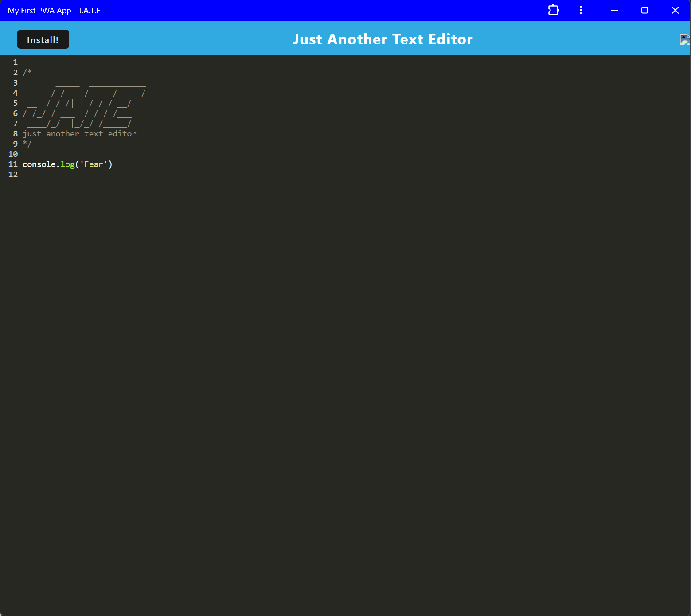

# Text_EditorWJR

## Description

In this challenge we completed code to create a text editor that runs in the browser. We completed the code to meet the Progressive Web Application criteria. This application allows user to store code snippets or notes and retrieve them for later use. 

## Repository

Link to Render App: 

## Technologies

- Written with JavaScript

## License

MIT License

## Mock-Up

The following image shows the application's functionality and appearance:

